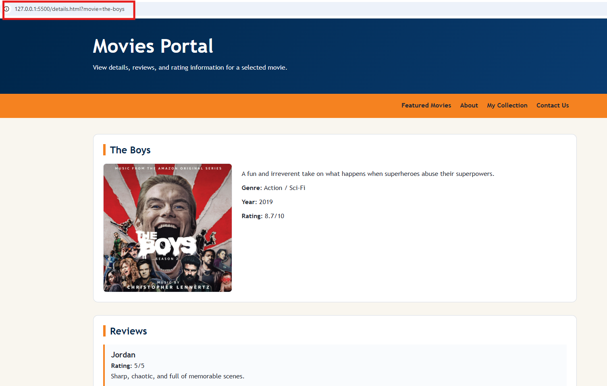
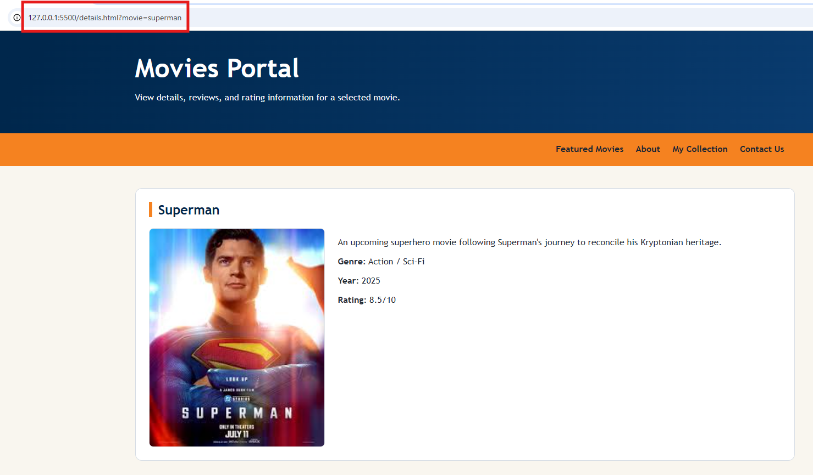
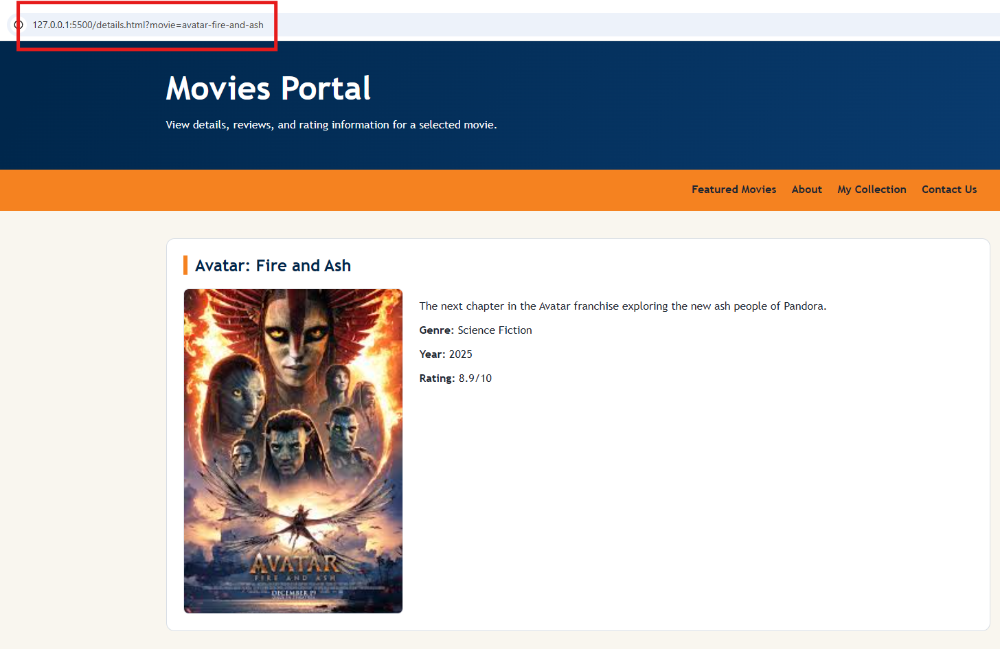
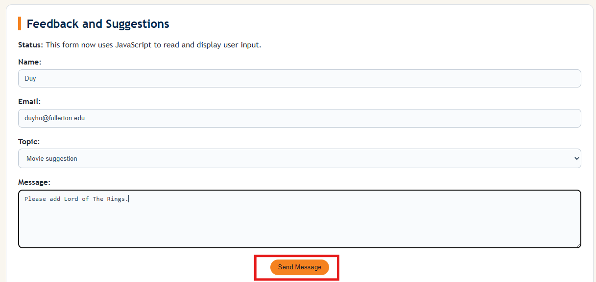
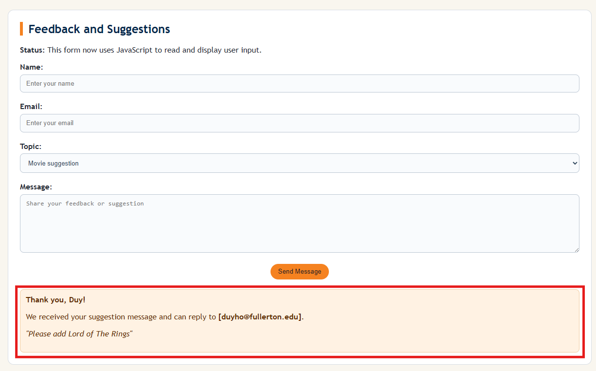
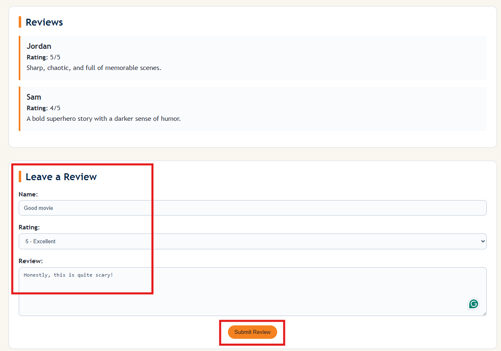
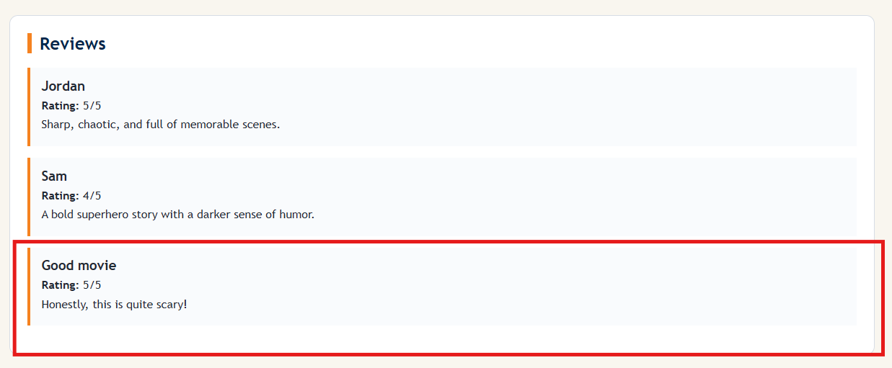

# CPSC-349 Lab 5: JavaScript Movies Portal

## Overview

In Lab 5, the goal is to add JavaScript behavior to the Movies Portal. Lab 4 used multiple static pages. Lab 5 introduces one dynamic movie details page, form input handling, and temporary review rendering.

Earlier, we described HTML as the building structure of a website and CSS as the decoration, color, and visual design. JavaScript is the part that makes the website respond to the user. Using a restaurant analogy, HTML is the restaurant building, CSS is the interior design, and JavaScript is the waiter who takes requests from the customer and brings information back to the table.

Later, the kitchen can represent the backend: the place where data is stored, processed, and sent back. Our course focuses on the frontend. A complete frontend usually uses all three pieces together: HTML for structure, CSS for presentation, and JavaScript for interaction.

You may complete this lab using the current Movies Portal template, or you may migrate the same JavaScript features into your own portal. Either way, the JavaScript should work correctly.

This lab practices:

1. Using JavaScript with `.js` file.
2. Reading URL query parameters
3. Storing movie data in JavaScript
4. Updating page content with the DOM
5. Handling form submissions and reading input values from forms
6. Rendering new reviews on the page

---

## Project Structure

The project now uses folders for CSS and JavaScript:

```text
css/styles.css
js/app.js
images/
```

HTML files should link to the stylesheet like this:

```html
<link rel="stylesheet" href="css/styles.css">
```

Pages that use JavaScript should load [js/app.js](js/app.js) before the closing `</body>` tag:

```html
<script src="js/app.js"></script>
```

---

## Demo: Dynamic Details Page

Instead of creating `details_1.html`, `details_2.html`, and `details_3.html`, Lab 5 uses one shared [details.html](details.html) page. The details links and the basic movie rendering logic are already completed in the starter code and will be demoed by the instructor.

In the demo, each featured movie link sends a query parameter in the URL:

```html
<a class="btn" href="details.html?movie=the-boys">View Details</a>
<a class="btn" href="details.html?movie=superman">View Details</a>
<a class="btn" href="details.html?movie=avatar-fire-and-ash">View Details</a>
```

The `movie` value tells JavaScript which movie to display. In [js/app.js](js/app.js), `URLSearchParams` reads the URL:

```js
const params = new URLSearchParams(window.location.search);
const movieId = params.get("movie");
```

Then JavaScript uses that ID to render the correct movie title, image, description, genre, year, and rating on [details.html](details.html).

This instructor demo covers:

1. Updating **View Details** links on [index.html](index.html)
2. Reading the `movie` query parameter from the URL
3. Finding the matching movie data in [js/app.js](js/app.js)
4. Updating [details.html](details.html) by directly modifying DOM values

Use these screenshots as references for the three movie detail states:







---

## Demo: Contact Us Form

The Contact Us page demonstrates how JavaScript reads form input and displays it back on the page.

The message appears in [contact.html](contact.html), but the logic is handled in [js/app.js](js/app.js).

Before submitting:



After submitting:



The form should:

1. Stop the page from refreshing with `event.preventDefault()`
2. Read the name, email, topic, and message inputs
3. Show a confirmation message on the page
4. Display the email in bold inside brackets, such as `[student@example.com]`
5. Display the message in italics inside quotation marks

---

## Task 1: Create the Review Section

On [details.html](details.html), create a review section that displays the current movie's reviews.

The review section should be rendered with JavaScript from the movie data in [js/app.js](js/app.js). If a movie has no reviews, display a message such as:

```text
No reviews have been added yet.
```

---

## Task 2: Add Leave a Review with JavaScript

Add a **Leave a Review** section to [details.html](details.html). The form should include:

1. Name
2. Rating
3. Review text
4. Submit Review button

When the form is submitted, JavaScript should add the new review to the current list of reviews on the page.

This new review is temporary. It only exists for the current render of the page. If the page is refreshed, the added review disappears because we have not used browser storage, a backend, or a database yet.

Here are the references: 

Before submitting:



After submitting, a new review should be added to the list:



---

## Submission Requirements

Students must submit:

1. Updated Lab 5 repository with completed HTML, CSS, and JavaScript files
2. Review section rendered from JavaScript data
3. Leave a Review form that temporarily adds a new review to the current page render
4. Screenshots showing the three details page states and the Contact Us form before and after submitting
